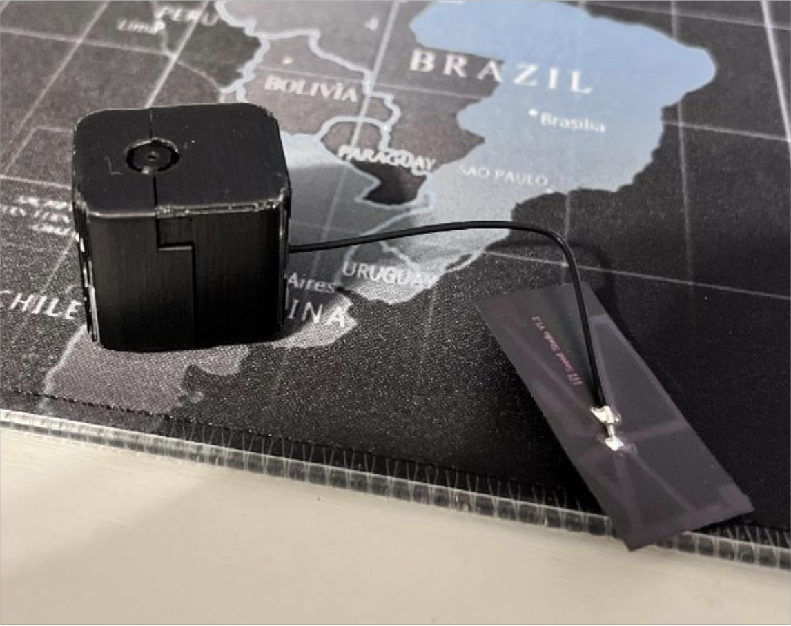

# What is ParkSense?

Leveraging real-time computer vision on the edge, ParkSense provides real-time parking lot capacity tracking for campus, sporting events, retail, and many other parking lot settings.

We developed ParkSense using the [ESP32s3](https://www.seeedstudio.com/XIAO-ESP32S3-p-5627.html?gad_source=1&gclid=CjwKCAjw9IayBhBJEiwAVuc3fjy7BQsDdvPK5KJzw_hz1yBiIKzPyLZ91Xxr-qeByd02p219zY0WAhoCu1kQAvD_BwE) and specialize our car detection/localization tasks on top of [MobileNetv2](https://arxiv.org/abs/1801.04381).

We currently provide a web-based frontend, developed in [React](https://react.dev/).

# Team Members (by contribution)

**Frontend**:

- Sam Aldeguer
- Troy D'Amico
- Aaron Horton

**API/Hosting**:
- Troy D'Amico
- Landen Doty

**Device/CNN**:
- Landen Doty
- Sepehr Noori

## Frontend Availability Page

[./docs/imgs/Frontend_Demo_Availability_Page.mp4](https://github.com/landoty/ParkSense/assets/64577529/cc7c4e7a-27b4-4ed5-aa57-9d9f8231c778)

## Microcontroller Custom Housing

# Notes and Acknowledgements 

Created for EECS581/582 Senior Capstone at the University of Kansas
